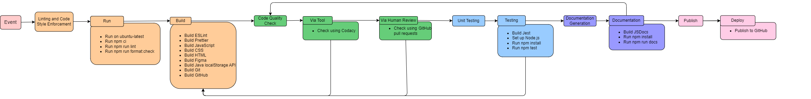

# Phase1

## Status Rough Overview
In terms of our current progress status, we have:
- Created GitHub repository
- Implemented JSdocs to test documentation creation
- Implemented Jest into GitHub Actions
- Implemented demo of Codacy
- Installed ESLint and Prettier

### Linting and Code Style Enforcment
As of currently, we created a `GitHub` repository for the project. We also installed our `ESLint` for our editor to catch bugs and maintain code quality. In addition, we installed `Prettier`, to use at the same time in our editor, for automatic formatting. Both of which will standardize our code quality.

For designing the front end of our project, we are expecting to use `Figma` to focus on user experience. Additionally, we planning to soon use vanilla `JavaScript`, `CSS`, `HTML`. In the near future, we also plan to implement `Java localStorage API`.
### Code Quality Via Tool
Although we do not have code of features for the project written yet, we decided to use `Codacy` for our automated code quality checking for the future use. Instead, we wrote sample code to create a demonstration of `Codacy`'s effectiveness.

### Code Quality Via Human Review
To review code manually, we are currently using `GitHub Pull Requests` and plan to continue using this feature for future use. This practice has already been implemented in our team progression.

### Unit Test Via Automation
Out of all the automated unit testing softwares, we decided to use `Jest` for our JavaScript unit testing framework. As of now, we implemented `Jest` into our GitHub Actions in order to view testing in real-time.

### Documentation Generation Via Automation
For automated documentation generation, we will being using `JSDocs` as it more geared towards `JavaScript`. Currently, we implemented `JSDocs` to test documentation creation.

### Deployment
Since we have yet to create or built anything substantial in this phase of the project, we have yet to deploy our project through publishing on GitHub.